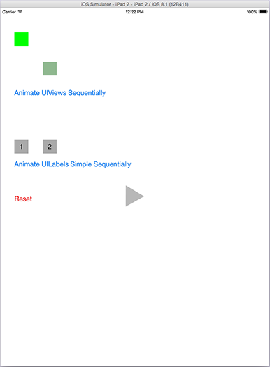

# AnimateSequentially

> `AnimateSequentially` is a very simple example that demonstrates how Sequential Animation of a UIView can successfully be achieved using the  UIView class method:

``` objc
+ (void)animateWithDuration:(NSTimeInterval)duration animations:(void (^)(void))animations completion:(void (^)(BOOL finished))completion
```

However, it does not work so well with UILabel, a subclass of UIView. For example: UILabel's alpha property and center position can be animated used this technique, but its backgroundColor and textColor cannot.



## Requirements

`AnimateSequentially` uses ARC and requires iOS 6.0+.

## License

    The MIT License (MIT)

    Copyright (c) 2015 Steve Greenwood

    Permission is hereby granted, free of charge, to any person obtaining a copy
    of this software and associated documentation files (the "Software"), to deal
    in the Software without restriction, including without limitation the rights
    to use, copy, modify, merge, publish, distribute, sublicense, and/or sell
    copies of the Software, and to permit persons to whom the Software is
    furnished to do so, subject to the following conditions:

    The above copyright notice and this permission notice shall be included in
    all copies or substantial portions of the Software.

    THE SOFTWARE IS PROVIDED "AS IS", WITHOUT WARRANTY OF ANY KIND, EXPRESS OR
    IMPLIED, INCLUDING BUT NOT LIMITED TO THE WARRANTIES OF MERCHANTABILITY,
    FITNESS FOR A PARTICULAR PURPOSE AND NONINFRINGEMENT. IN NO EVENT SHALL THE
    AUTHORS OR COPYRIGHT HOLDERS BE LIABLE FOR ANY CLAIM, DAMAGES OR OTHER
    LIABILITY, WHETHER IN AN ACTION OF CONTRACT, TORT OR OTHERWISE, ARISING FROM,
    OUT OF OR IN CONNECTION WITH THE SOFTWARE OR THE USE OR OTHER DEALINGS IN
    THE SOFTWARE.


